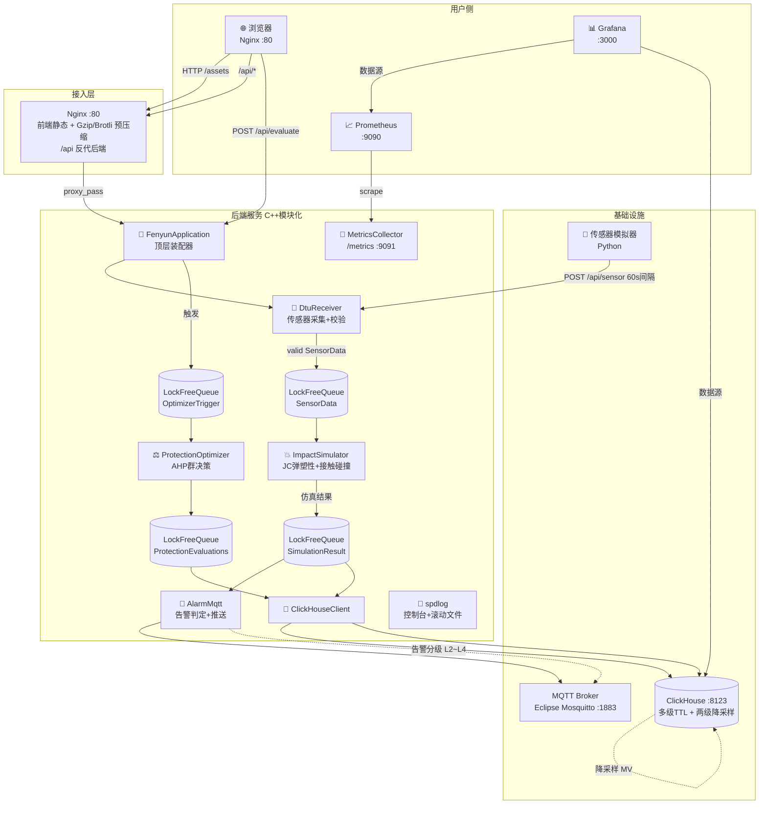

# 轒辒车 (Fén Yùn Chē) 结构防护仿真与滚石冲击分析系统  v1.2

> 古代春秋时期攻城冲车（轒辒车）结构防护仿真平台 · 某军事史团队复原研究用

```ascii
   _______________
  /  ░░牛皮/铁皮░  \     滚石从城头落下：v = √(2gh)
 |═════════════════|    E = ½mv²  →  Johnson-Cook 弹塑性本构
 |_ 车轮     车轮 _|    AHP评估牛皮/木材/铁皮/复合材料 4 种防护方案
  ‾‾‾‾‾‾‾‾‾‾‾‾‾‾‾‾
```

---

## 目录

1. [系统功能](#系统功能)
2. [架构设计](#架构设计)
3. [代码结构](#代码结构)
4. [部署步骤](#部署步骤)
   - [方式 A: Docker Compose 一键部署](#方式-a-docker-compose-一键部署-推荐)
   - [方式 B: 本地源码编译](#方式-b-本地源码编译)
5. [传感器模拟器](#传感器模拟器)
6. [REST API 文档](#rest-api-文档)
7. [观测：日志 + 指标](#观测日志--指标)
8. [ClickHouse 数据保留与降采样](#clickhouse-数据保留与降采样)
9. [MQTT 告警 Topic 约定](#mqtt-告警-topic-约定)
10. [常见问题](#常见问题)

---

## 一、系统功能

| 模块 | 能力 |
|---|---|
| 🌐 **传感器采集（DtuReceiver）** | 每辆车每分钟上报顶棚应力、车轮变形、滚石冲击力、防护层厚度，10 项数据校验规则 |
| 💥 **结构仿真（ImpactSimulator）** | Johnson-Cook 高应变率耦合热软化本构；10×10 变形/应力云图；Hertz 接触碰撞时间估计；侵彻深度计算 |
| ⚖️ **AHP 防护优化（ProtectionOptimizer）** | 5 准则成对比较矩阵；WGGM 群决策聚合（10 位专家池）；Saaty 自修正一致性；群决策共识指数 |
| 🚨 **告警推送（AlarmMqtt）** | 变形超限 / 防护层击穿 / 应力超载三级阈值；告警 L1~L4 分级；MQTT topic 推送 |
| 📊 **3D 可视化** | Three.js 参数化轒辒车建模；GPU 滚石粒子（400 ShaderMaterial + 40 InstancedMesh）；顶棚变形颜色云图；OrbitControls 多视角 |
| 🗄️ **数据层** | ClickHouse MergeTree 多级 TTL；两级降采样物化视图；AggregatingMergeTree 日汇总 |

---

## 二、架构设计

### 2.1 总体架构



### 2.2 模块内部数据流（时序）

```mermaid
sequenceDiagram
    participant Sim as 🎲 模拟器
    participant DTU as DtuReceiver
    participant Q1 as SensorQueue
    participant IS  as ImpactSimulator
    participant Q2  as SimQueue
    participant AM  as AlarmMqtt
    participant CH  as ClickHouseWriter
    participant MQ  as MQTT Broker

    Sim->>+DTU: POST /api/sensor (JSON)
    DTU->>DTU:   10项校验规则
    alt 校验通过
        DTU->>Q1: push(SensorData)  ✅
        DTU-->>-Sim: 201 Created
    else 校验失败
        DTU-->>-Sim: 400 {reason, rule_id}
    end

    par 仿真线程
        loop 每个仿真worker
            Q1->>+IS: pop()
            IS->>IS: Johnson-Cook 弹塑性<br/>接触碰撞 + 变形场
            IS->>Q2: push(SimulationResult)
        end
    and 告警线程
        Q2->>+AM: pop()
        AM->>AM: 三级阈值判定
        alt 告警触发 (L2-L4)
            AM->>MQ: PUBLISH fenvun/vehicle/{id}/alert/*
        end
    and 存储写线程
        Q2->>+CH: pop()
        CH->>CH: TSV批量写入 (socket :8123)
        CH->>CH: 自动进入 5min/1h MV
    end
```

---

## 三、代码结构

```
AI_solo_coder_task_A_100/
├── backend/                          # 🔧 C++后端 (模块化)
│   ├── CMakeLists.txt                 #    CMake 3.18+ FetchContent: spdlog/prometheus-cpp
│   ├── include/
│   │   ├── common/                    #    基础层: 数据结构+JSON+LockFreeQueue+指标+日志
│   │   ├── config/                    #    JSON 配置加载器
│   │   ├── dtu_receiver/              #    📡 传感器采集校验
│   │   ├── impact_simulator/          #    💥 JC弹塑性仿真
│   │   ├── protection_optimizer/      #    ⚖️ AHP 群决策
│   │   ├── alarm_mqtt/                #    🚨 告警 + MQTT
│   │   ├── storage/                   #    💾 ClickHouse 客户端
│   │   ├── fenyun_application.h       #    🧩 顶层装配 (4模块+3队列)
│   │   └── fenyun_http_server.h       #    🌐 HTTP API 层
│   ├── src/
│   └── config/
│       ├── system.json                 #    全局配置 (HTTP/CH/MQTT/阈值/线程池)
│       ├── materials.json              #    4材料+Johnson-Cook参数
│       └── ahp_weights.json            #    AHP矩阵+专家池+方案配置
│
├── frontend/                         # 🖥 前端 (模块化 ES Modules)
│   ├── index.html                      #    入口 UI (importmap 免构建)
│   ├── app.js                          #    启动器 (串联两个模块)
│   ├── assault_cart_3d.js              #    3D渲染: Three.js + GPU粒子 + 云图
│   └── protection_panel.js             #    UI层: 数据/图表/AHP表/告警
│
├── database/                         # 🗄️ ClickHouse DDL
│   └── init_clickhouse.sql             #    多级TTL + 两级降采样MV + Projections
│
├── simulator/                        # 🎲 Python 传感器模拟器
│   └── sensor_simulator.py             #    参数化滚石大小/冲击高度/场景预设
│
├── deploy/                           # ⚙️ 部署配置
│   ├── nginx/                          #    Nginx (Gzip/Brotli 预压缩 + 反代)
│   ├── mosquitto/                      #    Eclipse Mosquitto MQTT 配置
│   ├── prometheus/                     #    Prometheus 抓取配置
│   └── grafana/                        #    Grafana 数据源预配置
│
├── Dockerfile.backend                # 🐳 C++ 两阶段构建 (builder + runtime)
├── Dockerfile.frontend               # 🐳 前端 Nginx 两阶段 (预压缩 + runtime)
├── Dockerfile.simulator              # 🐳 Python 模拟器
├── docker-compose.yml                # 🐳 docker-compose 一键编排
│
└── README.md                         # 📖 本文档
```

---

## 四、部署步骤

### 方式 A：Docker Compose 一键部署（推荐）

> 需要：Docker 25+、Docker Compose v2+

```bash
# 1. 克隆/进入项目目录
cd AI_solo_coder_task_A_100

# 2. 启动全部服务 + 监控（前端/后端/CH/MQTT/模拟器/Prometheus/Grafana）
docker compose --profile all up -d --build

# 或者仅启动核心服务（不含监控面板）
docker compose up -d --build

# 3. 查看服务健康状态
docker compose ps
# NAME                    STATUS
# fenyun-frontend        Up (healthy) → http://localhost:80
# fenyun-backend         Up (healthy) → http://localhost:8080/api/health
# fenyun-clickhouse      Up (healthy) → http://localhost:8123
# fenyun-mosquitto       Up (healthy) → mqtt://localhost:1883
# fenyun-sensor-simulator  Up

# 4. 查看组件日志
docker compose logs -f fenyun-backend     # C++后端日志（spdlog）
docker compose logs -f sensor-simulator   # 模拟器上报日志
docker compose logs -f clickhouse         # ClickHouse 日志

# 5. 打开浏览器
# 👉 前端可视化:        http://localhost:80
# 👉 后端健康检查:      http://localhost:8080/api/health
# 👉 Prometheus 指标:   http://localhost:9091/metrics (仅本机)
# 👉 Grafana 面板:      http://localhost:3000 (admin / Fenyun@2025)

# 6. 切换到密集滚石场景 (Heavy Siege)
docker compose --profile heavy-sim up -d

# 7. 切换到"固定参数实验" (例: 固定100kg+20m)
docker compose --profile siege up -d

# 8. 停止全部 / 清理数据卷
docker compose down
docker compose down -v   # ⚠️ 删除所有持久化数据
```

#### 服务端口一览

| 服务 | 端口 | 用途 |
|---|---|---|
| Nginx 前端 | `:80` | 静态资源 + 3D 可视化 + `/api` 反代 |
| C++ 后端 | `:8080` | HTTP API（直连） |
| Prometheus 指标 | `:9091` | `/metrics` 指标端点（仅本机） |
| ClickHouse HTTP | `:8123` | SQL 查询 / TSV 写入（仅本机） |
| ClickHouse Native | `:9000` | Native 协议（仅本机） |
| MQTT | `:1883` | 告警订阅（仅本机） |
| MQTT WS | `:9001` | WebSocket（仅本机） |
| Grafana | `:3000` | 监控面板（profile=monitoring） |
| Prometheus UI | `:9090` | 指标查询（profile=monitoring） |

---

### 方式 B：本地源码编译

> 需要：GCC 12+ / Clang 16+ / MSVC 2022；CMake 3.18+；Git（FetchContent 拉第三方）

```bash
# 1. 创建构建目录
cd backend
mkdir build && cd build

# 2. CMake 配置（默认启用 spdlog + Prometheus）
cmake .. -G Ninja -DCMAKE_BUILD_TYPE=Release

#    可选开关:
#      -DUSE_BOOST_LOCKFREE=ON    切换为 Boost.Lockfree 队列
#      -DBUILD_TESTS=ON           启用 GoogleTest 单元测试
#      -DENABLE_PROMETHEUS=OFF    禁用 Prometheus
#      -DENABLE_SPDLOG=OFF        禁用 spdlog（回退 std::cout）

# 3. 编译
cmake --build . --target fenyun_backend -j$(nproc)

# 4. 运行
./bin/fenyun_backend \
    --http-port 8080 \
    --config-dir ./config \
    --ch-host 127.0.0.1 \
    --ch-port 8123 \
    --mqtt-broker tcp://127.0.0.1:1883 \
    --def-threshold 20

# 5. 健康检查
curl http://127.0.0.1:8080/api/health
# → {"status":"ok","version":"1.2.0","uptime_s":...}

# 6. 指标（若启用了 Prometheus）
curl http://127.0.0.1:9091/metrics
```

---

## 五、传感器模拟器

### 5.1 快速开始

```bash
# 方式 1: docker compose 内置
docker compose run --rm sensor-simulator --help

# 方式 2: 直接运行 (Python 3.10+)
cd simulator
python sensor_simulator.py --help
```

### 5.2 冲击场景预设

| `--impact-profile` | 含义 | 滚石质量 | 冲击高度 | 直径 | 无冲击概率 |
|---|---|---|---|---|---|
| `light` | 轻袭（骚扰滚石） | 10-50 kg | 3-10 m | 8-20 cm | 25% |
| `normal` | 常规（默认） | 20-120 kg | 5-20 m | 12-35 cm | 10% |
| `heavy` | 猛攻 | 50-250 kg | 10-30 m | 25-60 cm | 0% |
| `barrage` | 密集滚石 | 30-180 kg | 15-40 m | 20-50 cm | 0% |
| `sniper` | 定点精准打击 | 80-200 kg | 25-50 m | 30-45 cm | 40% |

### 5.3 常用参数

| 参数 | 说明 | 示例 |
|---|---|---|
| `--api` | 后端 API 地址（也可用环境变量 `FENYUN_API`） | `http://192.168.1.100:8080` |
| `--vehicles` | 模拟车辆数量 1-5 | `3` |
| `--interval` | 上报间隔秒数 | `30` |
| `--impact-profile` | 场景预设（覆盖以下范围） | `heavy` |
| `--rock-mass-min/max` | 滚石质量范围 (kg) | `--rock-mass-min 50 --rock-mass-max 200` |
| `--drop-height-min/max` | 落下高度范围 (m) | `--drop-height-min 10 --drop-height-max 30` |
| `--rock-diameter-min/max` | 直径范围 (cm) | `--rock-diameter-min 20 --rock-diameter-max 50` |
| `--fixed-rock-mass` | **固定**滚石质量 (>0 生效) | `100` |
| `--fixed-drop-height` | **固定**冲击高度 (>0 生效) | `20` |
| `--fixed-rock-diameter` | **固定**滚石直径 (>0 会反推质量) | `30` |
| `--wear-scale` | 防护层磨损倍率 (0=永不磨损) | `2.0` |
| `--once` | 只上报一次后退出 | |
| `--stress N` | 压力测试模式：批量发送 N 条 | `--stress 5000` |
| `--config` | 从 JSON 配置文件加载参数 | |

### 5.4 使用示例

```bash
# 示例 1: 默认场景，3 辆车，60 秒间隔
python sensor_simulator.py

# 示例 2: 猛攻场景，30 秒密集上报
python sensor_simulator.py --impact-profile heavy --interval 30

# 示例 3: 军事史实验重放 - 固定质量 100kg + 固定高度 20m（确定性）
python sensor_simulator.py \
    --fixed-rock-mass 100 \
    --fixed-drop-height 20 \
    --vehicles 3 \
    --interval 10

# 示例 4: 固定滚石直径 30cm（自动反推质量约 36kg）
python sensor_simulator.py --fixed-rock-diameter 30

# 示例 5: 自定义范围
python sensor_simulator.py \
    --rock-mass-min 50  --rock-mass-max 300 \
    --drop-height-min 8  --drop-height-max 40 \
    --vehicles 5 \
    --no-impact-prob 0.05

# 示例 6: 压力测试 - 快速灌入 5000 条历史数据
python sensor_simulator.py --stress 5000
```

### 5.5 上报数据字段

```json
{
  "vehicle_id":            1,
  "timestamp_ms":          1718670000000,
  "roof_stress":           142.3,
  "wheel_deformation":     2.46,
  "rock_impact_force":     38.2,
  "protection_thickness":  80.0,
  "protection_material":   "wood",
  "ambient_temp":          20.0,
  "impact_location_x":     3.2,
  "impact_location_y":     1.4,
  "rock_mass":             127.4,
  "rock_velocity":         19.8,
  "rock_diameter_mm":     452.1,   // 🆕 v1.2 新增
  "drop_height_m":         20.0,    // 🆕 v1.2 新增
  "impact_energy_j":     25000.0
}
```

> 物理一致性保证：
> 1. `velocity ≈ sqrt(2 × g × drop_height_m)`（自由落体）
> 2. `rock_mass ≈ 4/3 × π × (rock_diameter_mm/2)³ × 2550 kg/m³`（花岗岩密度 2550）
> 3. `impact_energy_j = ½ × m × v²`

---

## 六、REST API 文档

### 6.1 健康检查

```http
GET /api/health
```

**响应 (200):**
```json
{
  "status": "ok",
  "version": "1.2.0",
  "uptime_s": 428,
  "modules": {
    "dtu_receiver":          "running",
    "impact_simulator":      "running (N=4 workers)",
    "protection_optimizer":  "idle",
    "alarm_mqtt":            "connected",
    "clickhouse":            "connected"
  },
  "queues": {
    "sensor": 0, "simulation": 0, "evaluation": 0
  }
}
```

---

### 6.2 配置 & 元数据

| 方法 | 路径 | 说明 |
|---|---|---|
| GET | `/api/config` | 获取当前系统配置（脱敏） |
| GET | `/api/ahp/weights` | 获取 AHP 准则矩阵 + 专家池 + 方案列表 |
| GET | `/api/materials` | 获取材料参数表 |

---

### 6.3 传感器数据

**单条上报:**
```http
POST /api/sensor
Content-Type: application/json

{ "vehicle_id": 1, "roof_stress": 142.3, "...": "..." }
```
→ `201 Created` | `400 {error:"invalid", rule_id:7}`

**批量上报:**
```http
POST /api/sensor/batch
Content-Type: application/json

[ {...}, {...}, {...} ]
```
→ `202 {accepted: N, rejected: M}`

**历史查询:**
```http
GET /api/sensor/history?vehicle_id=1&start_ts=1718670000&end_ts=1718756400&limit=1000
```

---

### 6.4 仿真 & 评估

| 方法 | 路径 | 说明 |
|---|---|---|
| GET | `/api/simulation/latest?vehicle_id=1` | 获取该车辆最近仿真结果（含 10×10 云图） |
| POST | `/api/evaluate?vehicle_id=1` | 触发 AHP 防护方案评估；返回 4 方案排序 + 推荐 |

---

## 七、观测：日志 + 指标

### 7.1 日志（spdlog）

位置：Docker 卷 `fenyun-backend-logs:/app/logs`，或本地 `./logs/`

```
logs/
├── fenyun.log            当前日志文件 (50MB 滚动)
├── fenyun.log.1          第1份滚动
├── ...
└── fenyun.log.10         最多保留10份
```

格式：
```
[2025-06-18T09:06:54.123] [info] [42] Sensor received vehicle_id=1
[2025-06-18T09:06:54.132] [info] [51] Simulation complete vid=1 damage=3 def=16.13mm stress=143.23MPa
[2025-06-18T09:06:54.133] [warning] [67] ALERT L3 deformation=16.13mm threshold=12mm
```

---

### 7.2 Prometheus 指标 (`:9091/metrics`)

| 指标 | 类型 | 说明 |
|---|---|---|
| `fenyun_sensor_received_total` | Counter | 传感器样本接收总数 |
| `fenyun_sensor_valid_total` | Counter | 通过校验数 |
| `fenyun_sensor_invalid_total` | Counter | 校验拒绝数 |
| `fenyun_sensor_dropped_total` | Counter | 队列溢出丢弃数 |
| `fenyun_simulation_latency_ms` | Histogram | 仿真耗时 (桶:0.1ms~500ms) |
| `fenyun_simulation_total` | Counter | 仿真总数 |
| `fenyun_ahp_consistency_ratio` | Histogram | AHP CR 值分布（目标<0.1） |
| `fenyun_alerts_total{level,type}` | Counter | 告警按级别/类型统计 |
| `fenyun_clickhouse_rows_written_total` | Counter | 写入 ClickHouse 行数 |
| `fenyun_http_requests_total{method,path,status}` | Counter | HTTP 请求统计 |
| `fenyun_http_request_latency_ms` | Histogram | HTTP 请求延迟 |
| `fenyun_queue_approx_size{queue}` | Gauge | 各队列近似长度 |

#### PromQL 示例

```promql
# 每秒传感器数据接收率
rate(fenyun_sensor_received_total[5m])

# 仿真 P95 延迟
histogram_quantile(0.95, sum(rate(fenyun_simulation_latency_ms_bucket[5m])) by (le))

# AHP 评估 CR>0.1 比例（异常评分占比）
sum(increase(fenyun_ahp_consistency_ratio_bucket{le="0.1"}[1h]))
/ sum(increase(fenyun_ahp_consistency_ratio_count[1h]))

# 告警级别分布图 (Grafana Pie)
sum by (level) (increase(fenyun_alerts_total[24h]))
```

---

## 八、ClickHouse 数据保留与降采样

### 8.1 多级 TTL 保留策略

| 表 | 粒度 | 保留时长 | 用途 |
|---|---|---|---|
| `sensor_data` | 原始 (60s) | **7 天** | 实时分析；高频原始快速释放 |
| `sensor_data_5min` | 5 分钟聚合 | **30 天** | 趋势分析；p95/p99 极值；Avg/Max |
| `sensor_data_1h` | 1 小时聚合 | **1 年** | 长期历史回顾；冲击事件统计 |
| `simulation_results` | 原始含云图 | **90 天** | 含 Array(Float32) 云图；较高体积 |
| `simulation_results_1h` | 1 小时聚合 | **1 年** | 结构性能趋势；损伤分布 |
| `alert_records` | 原始告警 | **2 年** | 合规审计；不可删除 |
| `alert_daily_summary` | 日汇总 (SummingMT) | 永久 | 年度报表；SLA 统计 |
| `protection_evaluation` | AHP 评估 (ReplacingMT) | 永久 | 方案版本对比；专家决策留痕 |
| `vehicle_status_summary` | 日汇总 (AggregatingMT) | 永久 | 车辆生命周期健康画像 |

### 8.2 两级降采样物化视图

```
sensor_data (RAW 60s, 7天)
   │
   └─Materialized View「sensor_data_5min_mv」
        └→ sensor_data_5min (avg, max, p95, p99, 总能量) (30天)
              │
              └─Materialized View「sensor_data_1h_mv」
                   └→ sensor_data_1h (再聚合 + 冲击事件计数) (1年)
```

### 8.3 查询示例

```sql
-- 某辆车过去 24h 顶棚应力小时趋势 (直接查1h聚合表，秒级响应)
SELECT time_bucket, avg_roof_stress, max_roof_stress, p95_roof_stress
FROM fenyun_vehicle.sensor_data_1h
WHERE vehicle_id = 1
  AND time_bucket >= now() - INTERVAL 1 DAY
ORDER BY time_bucket;

-- 全年告警统计 (SummingMergeTree 自动求和)
SELECT event_date, sum(level2_cnt), sum(level3_cnt), sum(level4_cnt)
FROM fenyun_vehicle.alert_daily_summary
WHERE event_date >= '2025-01-01'
GROUP BY event_date WITH TOTALS
ORDER BY event_date;
```

---

## 九、MQTT 告警 Topic 约定

```
fenvun/vehicle/{vehicle_id}/alert/{alert_type}
```

| `{alert_type}` | 触发条件 | 典型级别 |
|---|---|---|
| `deformation` | 顶棚变形 > 阈值 (默认 20mm) | L2(黄) → L4(红) |
| `penetration` | 防护层侵彻深度 > 厚度 | L3(橙) / L4(红) |
| `stress`      | Von Mises 应力 > 0.85 × σ_ult | L2 / L3 |
| `fatigue`     | 应力循环累计疲劳指标 | L2 |

### MQTT 消息体 (JSON)

```json
{
  "version":         "1.2",
  "ts_ms":           1718670000123,
  "vehicle_id":      1,
  "vehicle_name":    "先锋一号",
  "alert_type":      "deformation",
  "alert_level":     3,
  "alert_level_str": "SEVERE",
  "message":         "[JC 应变率380/s] 变形超限: 24.13mm > 20mm",
  "measured_value":  24.13,
  "threshold_value": 20.0,
  "metric_unit":     "mm",
  "simulation_ref":  { "sim_id": 88123, "roof_stress_mpa": 178.4, "damage_level": 3 },
  "recommended_action": "立即撤离乘员，更换顶棚保护层"
}
```

### 使用 `mosquitto_sub` 订阅示例

```bash
# 订阅所有车辆所有告警
mosquitto_sub -h 127.0.0.1 -p 1883 -v -t 'fenvun/vehicle/+/#'

# 只订阅 L3/L4 紧急变形告警 (需服务端过滤，此处topic不区分级别)
mosquitto_sub -h 127.0.0.1 -p 1883 -t 'fenvun/vehicle/1/alert/deformation'
```

---

## 十、常见问题

### Q1. ClickHouse 初始化不执行？
确认 `docker compose up -d` 前从未启动过 CH（或删除 `ch_data` 卷），因为 init script 仅在首次建库时执行。

```bash
docker compose down -v
docker compose up -d --build clickhouse
```

### Q2. 前端显示 `NaN` 变形值？
原因：后端 C++ 服务未启动，前端尝试 HTTP API 失败，虽然有本地 JC 仿真回退，但旧版浏览器缓存了问题代码。请清除浏览器缓存并硬刷新 `Ctrl+Shift+R`。

### Q3. Prometheus 指标抓取失败？
检查 `fenyun-backend` 容器 9091 端口是否监听：
```bash
docker compose exec fenyun-backend curl -s http://127.0.0.1:9091/metrics | head
```

### Q4. 模拟器固定直径后质量怎么和输入不一致？
这是**故意设计**的物理约束：直径→体积→质量（花岗岩密度 2550 kg/m³）是确定关系。若指定了 `--fixed-rock-diameter`，程序会使用由直径推导的质量而忽略范围。

### Q5. 如何接入真实 MQTT 消费端？
告警模块目前是桩实现（打印日志），若需真实发布，请在 `alarm_mqtt.cpp` 中链接 `paho.mqtt.cpp` 并在 MQTT 选项中调用 `mqtt::async_client` 真实发送。Docker 中已编排 Mosquitto，发布后可在任何 MQTT 客户端（MQTTX / Home Assistant / Node-RED）接收。

---

## 📜 License

本系统为军事史团队复原研究内部使用，材料参数、AHP 专家权重和 Johnson-Cook 参数均基于历史文献 + 学术工程经验校准。
